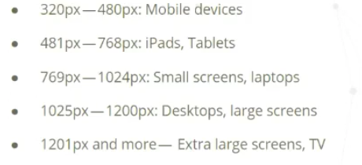

# Advanced CSS

## Positions

### Static
Static is the default position for all our elements.
This follows first come, first serve policy.

### Fixed
Doesnt care about parent position

### Absolute
If parent position is relative, absolute position will be relative to that

## Making Better Drop Shadow

A good practice for making awesome shadows is taking the "Y" value (which defines its verticallity) and double it to get a soft value for "Blur"
Eg. if Y is 40, keep blur as 80

## Media Query

For framework like Bootstrap and Bulma, you can use their standard breakpoints

## Flexbox

### Flexbox container

Flexbox container is responsibile for laying spacing between the items and positioning of items inside the items

Flexbox items property can override flexbox container properties

flex-wrap allows to decide whether to put the items in another row or keep it all in one row.
Default is keeping all in one row.

flex-basis: It is the width of the flexbox

justify-content: align items to a side
- flex-start: align to the left
- flex-end: align to the right
- center: align to the center
- space-around: puts space around the flex items
- space-between: puts space between the flex items

align-self: aligns one element

align-items: This is a way on how flex items are laid out on cross axis

align-content: This is a way on how flex items are aligned out on cross axis

flex-grow: to resize different elements in row in different sizes. We can say the main container takes 3 spaces and small side bar takes 1 space

flex-shrink: go hand in hand with flex-grow

flex: combinatino of both in flex-grow and flex-shrink

order: to rearange the items in the element; Not recommended to use it since it will mess up with screen readers; Messes up form tab also

Flexbox is by default laid out in Row; and the way in which flex box is laid out determines the main axis and cross axis; if laid out in row, main axis would be the horizontal line (towards the row) and cross axis will be the vertical line; if laid out in column, main axis would be the vertical line (towards the column) and cross axis will be the horizontal line;

To style elements on the main axis use justify-content and align-items property
For justify-content properties, refer above

align-items:
- stretch (default, this is why flex items stretch)
- flex-start
- flex-end
- center

To wrap items onto different lines use flex-wrap: wrap

align-content is similar to justify-content but for cross axis

To get a column layout instead of default row layout; use flex-direction: column

### Flexbox items

Use the flex-shrink:0 if you do not want the particular flex item to shrink when the browser window gets smaller

flex-grow allows to grow an element into empty space

flex-basis gives a starting point for flex-grow to grow

Use align-self property in flex item to override container design

flex property - shorthand for flex-grow, flex-shrink and flex-basis
flex: flex-grow, flex-shrink, flex-basis 
You can specify only the ones you want

## CSS Grid

Grid: The entire canvas containing grid items.
Space between grid items is called grid space. 
Grid lines are dividers between all rows and columns.

fr:
We can use fr to specify that take as much space as the screen has and fill it (making responsive); analogous to flex grow

repeat(how many times to repeat, the size of each column) in value for grid-template-columns or grid-template-rows

If you do not know the number of rows or columns which will be coming, use grid-auto-rows and specify the size you want that row to automatically take

Specify min and max length in minmax if not sure
grid-auto-rows: minmax(min,max); 

Define grid-template-area in flex container and then in item define its grid-area